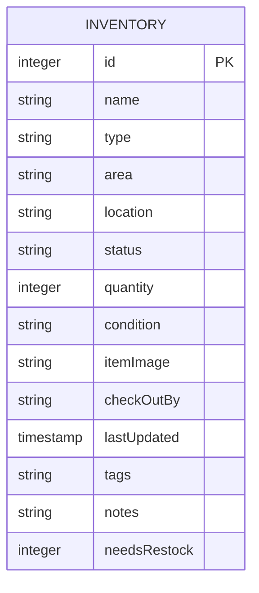

# Spare Pit

This inventory app was designed by Green River College students Augy Markham and Rebecca Riffle  to help First Robotics Competition teams track and manage inventory.

**Contents**
1. [Quick Start](#quick-start)
1. [User Guide](#user-guide)
1. [Developer Notes](#developer-notes)

## Quick Start
### Fork and Clone repo
Prerequisite: Free GitHub account, code editor such as VS Code

1. Go to the repository: https://github.com/AugleBoBaugles/spare-pit  
2. Click the **Fork** button in the top-right corner to create your own copy of the repo  
3. In your forked repo, click the green **Code** button and copy the HTTPS URL  
4. Open a terminal and run:

```
git clone <your-forked-repo-url>
cd spare-pit
```

### Initialize Inventory Database
```
npm run init-db
```
---
### Run Start Script
*This should be done from the root of the project*
#### Windows (Command Prompt)
```
start.bat
```
#### macOS / Linux / Git Bash
``` 
./start.sh
```

## User Guide
**Contents**

1. [Viewing and Editing Inventory](#viewing-and-editing-inventory)
1. [Flagging Items as Needs Restock](#flagging-items-as-needs-restock)
1. [Deleting an Item](#deleting-an-item)
1. [Dark Mode](#dark-mode)
1. [Troubleshooting](#troubleshooting)

### Viewing and Editing Inventory

#### Browsing the inventory

The inventory page shows a table of all tools, parts, and materials your team has logged. Each row shows the item name, type, location, and current status.

Click any row to expand it and see more details — area, quantity, condition, tags, and notes.

Click the row again to collapse it.

#### Status meanings

| Status | What it means |
|---|---|
| Available | In the pit and ready to use |
| Checked out | Signed out by a subteam — see "Last Checked Out By" for who last had it |
| Maintenance | Out of service, do not use |
| Missing | Cannot be located — report to a lead if you find it |

#### Editing an item

1. Find the item in the inventory list. Use the search bar at the top to filter by name, type, location, or status.
2. Click the **⋯** button at the right end of the row to open the actions menu.
3. Click **Edit**. The row expands and all fields become editable inputs.
4. Make your changes. Required fields (marked with **\***) cannot be left blank.
5. If you set the status to **Checked out**, a "Checked out by" field will appear — enter your subteam name (e.g. `electrical`, `programming`).
6. Click **Save** to apply your changes, or **Cancel** to discard them and go back to the read view.

If something goes wrong when saving, an error message will appear below the form. Your edits are preserved so you can try again.

### Flagging Items as Needs Restock

Use this when you notice that an item is running low and needs to be ordered.

#### Flagging an item

1. Find the item in the inventory list and click its row to expand it.
2. At the bottom of the expanded panel, click the **Needs Restock** toggle. The switch slides right to show the item is flagged.
3. To clear the flag from the expanded panel, click the toggle again — the switch slides back left.

#### Ordering from the Dashboard

1. Go to the **Dashboard**. Flagged items appear in the **Needs restock** section, showing each item's name, quantity, and location.
2. When you have ordered an item, click **Mark as restocked** next to it.
3. A quantity field will appear, pre-filled with the current quantity. Update it to reflect how many are now in the inventory, then click **Save**.
4. The item is removed from the restock list and its quantity is updated.

> **Note:** The Needs Restock flag is independent of an item's status — you can flag any item regardless of whether it is available, checked out, or otherwise.

### Deleting an Item

Use this when a tool should be permanently removed from the inventory — for example, when it has been retired from the team's kit or when a duplicate entry needs to be cleaned up.

1. Find the item in the inventory list.
2. Click the **⋯** button at the right end of the row to open the actions menu.
3. Click **Delete** (shown in red to signal it is a destructive action).
4. A confirmation dialog will appear. Type `DELETE` (all caps, case-sensitive) into the text box to confirm.
5. Click **Confirm** to permanently remove the item, or **Cancel** to go back without making any changes.

If the delete fails (for example, due to a network error), the dialog will close and an error message will appear below the item row. The item will remain in the inventory — you can try again.

> **Warning:** Deleting an item is permanent and cannot be undone. Make sure you have the right item before confirming.

### Dark Mode

Spare Pit supports light and dark mode so you can view the inventory comfortably in any environment.

A dark mode toggle sits in the **upper-right corner** of every page.

- Sun - Light Mode
- Moon - Dark Mode

Click the toggle once to switch modes. The preference is active for the current session.

### Troubleshooting
#### Reset Database
*Warning: This will delete ALL the contents of your database. Proceed with caution!*

`npm run reset-db`
## Developer Notes
### DB Schema


### needsRestock field

`needsRestock` is an `INTEGER` column (default `0`) on the `inventory` table. It acts as a boolean flag: `1` means the item is flagged for restock, `0` means it is not.

The flag is toggled via `PATCH /api/inventory/:id` with `{ needsRestock: 1 }` or `{ needsRestock: 0 }`. When a student marks an item as restocked from the Dashboard, the PATCH updates both `needsRestock` and `quantity` in a single request.

`initDb.js` includes an `ALTER TABLE` migration so the column is added to existing databases on next server start — no manual reset needed.

### Server Architecture

Incoming requests travel through a chain of layers, each with a single responsibility:

```
App -> Routers -> Controllers -> Services -> Models -> DB
```

**App** (`app.js`) is the entry point. It sets up Express and connects the routers.

**Routers** (`routes/`) define the URL paths (like `GET /api/inventory`) and hand each request off to the right controller.

**Controllers** (`controllers/`) receive the request, call the appropriate service, and send the response back to the client with the right status code (200 for success, 500 if something went wrong).

**Services** (`services/`) contain the business logic. This is where rules like filtering, sorting, or validating data would live.

**Models** (`models/`) are the only layer that talks to the database directly. They contain the SQL queries and return raw results up to the service.

**DB** (`db/db.js`) opens and manages the SQLite database connection.

### Delete Inventory Item

**Route:** `DELETE /api/inventory/:id`

**Success response (200):**
```json
{
  "message": "Cordless Drill has been deleted from the inventory",
  "deleted": { "id": 1, "name": "Cordless Drill", ... }
}
```

**Error responses:**
| Status | Condition |
|---|---|
| 404 | No item with the given `:id` exists in the database |
| 500 | Unexpected server error |

**Frontend data flow:**

```
User clicks Delete
  → handleDeleteClick() closes the dropdown and opens DeleteConfirmModal
  → User types "DELETE" and clicks Confirm
  → DeleteConfirmModal calls deleteInventory(id) (DELETE /api/inventory/:id)
  → On success: onDelete(id) removes the item from useInventory state; modal closes
  → On failure: onError(msg) sets deleteError in InventoryRow; modal closes; error row renders
```