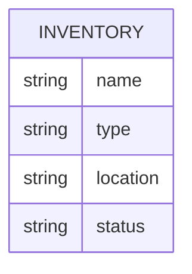

# Spare Pit

This inventory app was designed by Green River College students Augy Markham and Rebecca Riffle  to help First Robotics Competition teams track and manage inventory.

**Contents**
1. [Quick Start](#quick-start)
1. [User Guide](#user-guide)
1. [Developer Notes](#developer-notes)

## Quick Start
### Fork and Clone repo
Prerequisite: Free GitHub account, code editor such as VS Code

1. Go to the repository: https://github.com/AugleBoBaugles/spare-pit  
2. Click the **Fork** button in the top-right corner to create your own copy of the repo  
3. In your forked repo, click the green **Code** button and copy the HTTPS URL  
4. Open a terminal and run:

```
git clone <your-forked-repo-url>
cd spare-pit
```

### Initialize Inventory Database
```
npm run init-db
```
---
### Run Start Script
*This should be done from the root of the project*
#### Windows (Command Prompt)
```
start.bat
```
#### macOS / Linux / Git Bash
``` 
./start.sh
```

## User Guide
**Contents**

1. [Viewing and Editing Inventory](#viewing-and-editing-inventory)
1. [Filtering by Tags](#filtering-by-tags)
1. [Deleting an Item](#deleting-an-item)
1. [Dark Mode](#dark-mode)
1. [Troubleshooting](#troubleshooting)

### Viewing and Editing Inventory

#### Browsing the inventory

The inventory page shows a table of all tools, parts, and materials your team has logged. Each row shows the item name, type, location, and current status.

Click any row to expand it and see more details — area, quantity, condition, tags, and notes.

Click the row again to collapse it.

#### Status meanings

| Status | What it means |
|---|---|
| Available | In the pit and ready to use |
| Checked out | Signed out by a subteam — see "Checked out by" for who has it |
| Maintenance | Out of service, do not use |
| Missing | Cannot be located — report to a lead if you find it |

#### Editing an item

1. Find the item in the inventory list. Use the search bar at the top to filter by name, type, location, or status.
2. Click the **⋯** button at the right end of the row to open the actions menu.
3. Click **Edit**. The row expands and all fields become editable inputs.
4. Make your changes. Required fields (marked with **\***) cannot be left blank.
5. If you set the status to **Checked out**, a "Checked out by" field will appear — enter your subteam name (e.g. `electrical`, `programming`).
6. Click **Save** to apply your changes, or **Cancel** to discard them and go back to the read view.

If something goes wrong when saving, an error message will appear below the form. Your edits are preserved so you can try again.

### Filtering by Tags

Tags are short keywords attached to inventory items (e.g. `motor`, `battery`, `power`) that let you quickly narrow the list to a category of items.

#### Using the tag filter

1. On the inventory page, click the **Filter by tags** button to the right of the search bar.
2. A panel opens showing every tag currently in the database as clickable chips.
3. Click a chip to select it — the inventory table immediately updates to show only items that have that tag.
4. Click additional chips to tighten the filter. **All selected tags must be present** on an item for it to appear (AND logic). For example, selecting `motor` and `battery` shows only items tagged with both.
5. Click an active chip again to deselect it and widen the results.
6. Click outside the panel to close it.

When one or more tags are active the button label shows the count, e.g. **Filter by tags (2)**, so you can see what's active without reopening the panel.

The tag filter and the search bar work together — text search narrows results first, then the tag filter is applied on top.

#### Tag format when adding or editing items

Tags are stored as a comma-separated list in the **Tags** field, e.g. `motor, battery` or `power,drilling`. Rules:

- Each tag is a word or short phrase (letters, numbers, hyphens, spaces).
- Separate multiple tags with a comma.
- No empty segments — `motor,` or `motor,,battery` will be rejected with an inline error.
- Tags are case-insensitive when filtering (`Motor` and `motor` are treated as the same tag).

### Deleting an Item

Use this when a tool should be permanently removed from the inventory — for example, when it has been retired from the team's kit or when a duplicate entry needs to be cleaned up.

1. Find the item in the inventory list.
2. Click the **⋯** button at the right end of the row to open the actions menu.
3. Click **Delete** (shown in red to signal it is a destructive action).
4. A confirmation dialog will appear. Type `DELETE` (all caps, case-sensitive) into the text box to confirm.
5. Click **Confirm** to permanently remove the item, or **Cancel** to go back without making any changes.

If the delete fails (for example, due to a network error), the dialog will close and an error message will appear below the item row. The item will remain in the inventory — you can try again.

> **Warning:** Deleting an item is permanent and cannot be undone. Make sure you have the right item before confirming.

### Dark Mode

Spare Pit supports light and dark mode so you can view the inventory comfortably in any environment.

A dark mode toggle sits in the **upper-right corner** of every page.

- Sun - Light Mode
- Moon - Dark Mode

Click the toggle once to switch modes. The preference is active for the current session.

### Troubleshooting
#### Reset Database
*Warning: This will delete ALL the contents of your database. Proceed with caution!*

`npm run reset-db`
## Developer Notes
### DB Schema

### Server Architecture

Incoming requests travel through a chain of layers, each with a single responsibility:

```
App -> Routers -> Controllers -> Services -> Models -> DB
```

**App** (`app.js`) is the entry point. It sets up Express and connects the routers.

**Routers** (`routes/`) define the URL paths (like `GET /api/inventory`) and hand each request off to the right controller.

**Controllers** (`controllers/`) receive the request, call the appropriate service, and send the response back to the client with the right status code (200 for success, 500 if something went wrong).

**Services** (`services/`) contain the business logic. This is where rules like filtering, sorting, or validating data would live.

**Models** (`models/`) are the only layer that talks to the database directly. They contain the SQL queries and return raw results up to the service.

**DB** (`db/db.js`) opens and manages the SQLite database connection.

### Tag Filter

#### GET /api/inventory/tags

Returns a deduplicated, sorted, lowercase array of all tag strings currently in the database.

**Success response (200):**
```json
["battery", "drilling", "motor", "power"]
```

**Error response:**
| Status | Condition |
|---|---|
| 500 | Unexpected server error |

**Implementation:** The model layer fetches the raw `tags` column from every row that has a non-null, non-empty value. The service layer splits each value on commas, trims whitespace, lowercases each token, deduplicates with a `Set`, and sorts alphabetically before returning.

#### Tag filter architecture (frontend)

The tag filter runs as a **separate pass** from the text search inside `filterInventory(items, query, activeTags)`:

1. Text search (`query`) is applied first — case-insensitive substring match across name, type, location, status.
2. Tag filter (`activeTags`) is applied to the result — AND logic, meaning every selected tag must appear in the item's `tags` field (split on comma, trimmed, case-insensitive exact token match).

Either filter can be omitted independently. The `InventoryPage` fetches available tags lazily from `/api/inventory/tags` on the first time the dropdown is opened.

#### CSV tag validation

Both `AddItemPage` and `ExpandedPanel` validate the tags field on submit. The rule: if the field is non-empty, every comma-separated token must be non-empty after trimming. This rejects trailing commas (`motor,`), leading commas (`,motor`), and consecutive commas (`motor,,battery`). An inline field error is shown and the form is blocked from submitting until the value is corrected.

### Delete Inventory Item

**Route:** `DELETE /api/inventory/:id`

**Success response (200):**
```json
{
  "message": "Cordless Drill has been deleted from the inventory",
  "deleted": { "id": 1, "name": "Cordless Drill", ... }
}
```

**Error responses:**
| Status | Condition |
|---|---|
| 404 | No item with the given `:id` exists in the database |
| 500 | Unexpected server error |

**Frontend data flow:**

```
User clicks Delete
  → handleDeleteClick() closes the dropdown and opens DeleteConfirmModal
  → User types "DELETE" and clicks Confirm
  → DeleteConfirmModal calls deleteInventory(id) (DELETE /api/inventory/:id)
  → On success: onDelete(id) removes the item from useInventory state; modal closes
  → On failure: onError(msg) sets deleteError in InventoryRow; modal closes; error row renders
```