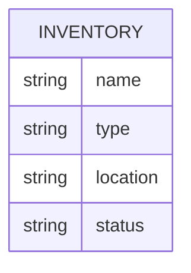

# Spare Pit

This inventory app was designed by Green River College students Augy Markham and Rebecca Riffle  to help First Robotics Competition teams track and manage inventory.

**Contents**
1. [Quick Start](#quick-start)
1. [User Guide](#user-guide)
1. [Developer Notes](#developer-notes)

## Quick Start
### Fork and Clone repo
Prerequisite: Free GitHub account, code editor such as VS Code

1. Go to the repository: https://github.com/AugleBoBaugles/spare-pit  
2. Click the **Fork** button in the top-right corner to create your own copy of the repo  
3. In your forked repo, click the green **Code** button and copy the HTTPS URL  
4. Open a terminal and run:

```
git clone <your-forked-repo-url>
cd spare-pit
```

### Install Dependencies
```
cd server
npm i
```
### Initialize Inventory Database
`npm run init-db`
## User Guide
**Contents**

1.[Troubleshooting](#troubleshooting)
### Troubleshooting
#### Reset Database
*Warning: This will delete ALL the contents of your database. Proceed with caution!*

`npm run reset-db`
## Developer Notes
### DB Schema

### Server Architecture

Incoming requests travel through a chain of layers, each with a single responsibility:

```
App -> Routers -> Controllers -> Services -> Models -> DB
```

**App** (`app.js`) is the entry point. It sets up Express and connects the routers.

**Routers** (`routes/`) define the URL paths (like `GET /api/inventory`) and hand each request off to the right controller.

**Controllers** (`controllers/`) receive the request, call the appropriate service, and send the response back to the client with the right status code (200 for success, 500 if something went wrong).

**Services** (`services/`) contain the business logic. This is where rules like filtering, sorting, or validating data would live.

**Models** (`models/`) are the only layer that talks to the database directly. They contain the SQL queries and return raw results up to the service.

**DB** (`db/db.js`) opens and manages the SQLite database connection.